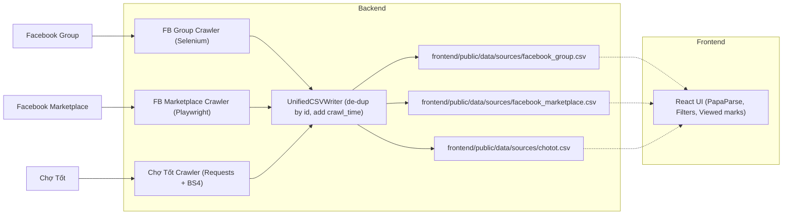
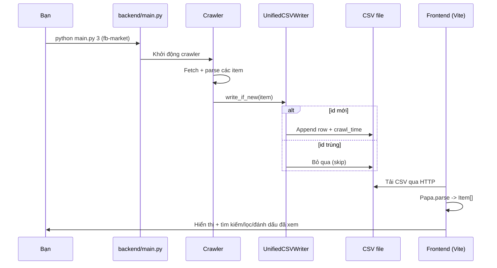

# Săn Đồ Cũ — Thu thập và xem dữ liệu rao vặt đa nguồn

Săn Đồ Cũ giúp bạn thu thập (crawl) bài đăng từ nhiều nguồn (Facebook Group, Facebook Marketplace, Chợ Tốt), chuẩn hoá dữ liệu về một định dạng CSV thống nhất, sau đó xem/tra cứu nhanh trên giao diện web.

**Tính năng chính**
- Thu thập từ 3 nguồn:
  - Facebook Group (Selenium)
  - Facebook Marketplace (Playwright)
  - Chợ Tốt (requests + BeautifulSoup)
- Ghi chung vào một nơi: `frontend/public/data/sources/*.csv` theo từng nguồn.
- Không trùng lặp: dùng cột `id` để tránh ghi trùng dữ liệu.
- Thêm cột `crawl_time` để nhận biết dữ liệu mới/cũ.
- Frontend gộp dữ liệu từ nhiều nguồn, hỗ trợ:
  - Tìm kiếm theo từ khoá, gợi ý tag
  - Lọc theo nguồn
  - Đánh dấu đã xem/chưa xem (lưu trên `localStorage`)

**Sơ đồ tổng quan**



**Kiến trúc & cấu trúc thư mục**

```text
.
├─ backend/
│  ├─ main.py                     # CLI chọn crawler
│  ├─ facebook_marketplace_crawler.py
│  ├─ facebook_group_crawler.py
│  ├─ chotot_crawler.py
│  ├─ login_and_save_state.py     # Lưu phiên FB -> facebook_state.json
│  ├─ utils/csv_writer.py         # Writer CSV: append + de-dup + crawl_time
│  └─ database/
└─ frontend/
   ├─ src/                        # React + TS + Tailwind
   └─ public/
      └─ data/
         └─ sources/
            ├─ facebook_group.csv
            ├─ facebook_marketplace.csv
            └─ chotot.csv
```
- `backend/`
  - `backend/main.py`: CLI chọn crawler để chạy.
  - `backend/facebook_marketplace_crawler.py`: Crawler Marketplace (Playwright, cần đăng nhập bằng session).
  - `backend/facebook_group_crawler.py`: Crawler Facebook Group (Selenium, dùng cookie/localStorage từ session).
  - `backend/chotot_crawler.py`: Crawler Chợ Tốt (requests/BeautifulSoup).
  - `backend/login_and_save_state.py`: Lưu phiên đăng nhập Facebook vào `facebook_state.json` để tái sử dụng.
  - `backend/utils/csv_writer.py`: Writer CSV thống nhất, append + chống trùng + tự thêm `crawl_time`.
  - `backend/database/`: Các hàm SQLite (tùy chọn, phục vụ FB Group).
  - `backend/data/raw/`: Thư mục tạm cũ (đã không còn dùng, bộ mã sẽ tự dọn các file .csv cũ ở đây).
- `frontend/`
  - `frontend/src/`: Ứng dụng React + TypeScript + Tailwind UI.
  - `frontend/public/data/sources/`: Đầu ra CSV cho từng nguồn: `facebook_group.csv`, `facebook_marketplace.csv`, `chotot.csv`.
  - `frontend/index.html`, cấu hình Vite/Tailwind.

**Yêu cầu hệ thống**
- Python: repo đang chỉ định `3.14` (`backend/.python-version`, `backend/pyproject.toml`).
  - Nếu máy bạn chưa có 3.14, có thể dùng 3.12+ và chỉnh lại `requires-python` tương ứng.
- Node.js 18+ (để chạy frontend dev).
- Trình duyệt Chrome (Selenium quản lý ChromeDriver tự động) và Playwright browsers.

**Cài đặt nhanh**
- Backend
  - Cài dependencies (pip/uv tuỳ bạn):
    - Pip (ví dụ với Python 3.12):
      - `python3 -m venv backend/.venv && source backend/.venv/bin/activate`
      - Sửa `backend/pyproject.toml` mục `requires-python` thành `>=3.12`
      - `pip install beautifulsoup4 dateparser playwright requests selenium tenacity webdriver-manager`
    - Hoặc dùng `uv` (đã có `uv.lock`): `cd backend && uv sync`
  - Cài Playwright browsers: `python -m playwright install`
- Lưu phiên đăng nhập Facebook (bắt buộc cho Marketplace/Group)
  - Chạy từ thư mục `backend/`:
    - `python login_and_save_state.py`
    - Đăng nhập Facebook thủ công trong cửa sổ bật lên, quay lại terminal và nhấn Enter để lưu `facebook_state.json`.
  - Ghi chú: FB Group crawler hiện có hỏi `FB_USER`/`FB_PASS` nhưng quá trình đăng nhập thực tế dựa trên `facebook_state.json`. Bạn có thể đặt biến môi trường cho tiện, nhưng không bắt buộc.
- Chạy crawler (từ `backend/`):
  - `python main.py 1` hoặc `python main.py fb-group` (tuỳ chọn `--headless`, `--count`)
  - `python main.py 2 --start 1 --end 3` hoặc `python main.py chotot`
  - `python main.py 3` hoặc `python main.py fb-market`
  - Khi chạy, dữ liệu sẽ được ghi/append vào:
    - `frontend/public/data/sources/facebook_group.csv`
    - `frontend/public/data/sources/facebook_marketplace.csv`
    - `frontend/public/data/sources/chotot.csv`
  - Bộ mã sẽ tự dọn các file CSV cũ có timestamp trong `backend/data/raw` và `frontend/public/data/sources` để tránh nhầm lẫn.
- Frontend
  - `cd frontend && npm install`
  - Dev server: `npm run dev`
  - Build: `npm run build` (đầu ra ở `frontend/dist/`)

**Luồng dữ liệu (một lần chạy crawl)**



**Định dạng dữ liệu CSV**
- Các cột thống nhất (theo thứ tự):
  - `id` — khoá duy nhất theo từng nguồn (dùng để chống trùng)
  - `title`
  - `description`
  - `price`
  - `location`
  - `seller`
  - `post_url`
  - `image`
  - `crawl_time` (ISO, được tự thêm khi ghi)
- Ghi chú:
  - Writer sẽ tự thêm `crawl_time` cho bản ghi mới. Nếu file cũ chưa có cột này, writer sẽ nâng cấp header tự động.
- `write_if_new()` đảm bảo không ghi trùng dựa trên trường `id`.

**Frontend: đường đi dữ liệu**

```mermaid
graph TD
  CSV1[facebook_group.csv] --> P[Papaparse]
  CSV2[facebook_marketplace.csv] --> P
  CSV3[chotot.csv] --> P
  P --> N[Chuẩn hoá -> Item]
  N --> F[Filters + Tabs\n(All/Viewed/Unviewed)]
  F --> V[Danh sách + Thẻ + Link bài]
```

**Tuỳ biến**
- Facebook Marketplace: chỉnh truy vấn tìm kiếm tại `backend/facebook_marketplace_crawler.py` trong hàm `search()` (biến `marketplace_url`).
- Facebook Group: chỉnh `group_id`/`group_url` tại `backend/facebook_group_crawler.py` trong `handle_scrape_command()`.
- Chợ Tốt: chỉnh `base_url` tại `backend/chotot_crawler.py`.

**Công nghệ sử dụng**
- Backend: Python, Selenium, Playwright, Requests, BeautifulSoup, Tenacity, SQLite (tùy chọn)
- Frontend: React + TypeScript, Vite, Tailwind CSS, HeadlessUI, Heroicons, PapaParse

**Khắc phục sự cố (Troubleshooting)**
- Playwright lỗi trình duyệt: chạy `python -m playwright install` và thử lại.
- Selenium yêu cầu Chrome: cần cài Chrome, `webdriver-manager` sẽ tự tải driver phù hợp.
- Chưa có Python 3.14: dùng 3.12+ và chỉnh `backend/.python-version` + `requires-python` tương ứng.
- Không load được CSV trên UI: đảm bảo file có trong `frontend/public/data/sources/` và server dev đang chạy.
- Facebook session hết hạn: chạy lại `python backend/login_and_save_state.py` để lưu session mới.

**Lệnh nhanh (tóm tắt)**
- Lưu session: `python backend/login_and_save_state.py`
- FB Group: `python backend/main.py 1 --count 20 [--headless]`
- Chợ Tốt: `python backend/main.py 2 --start 1 --end 3`
- FB Marketplace: `python backend/main.py 3`
- Frontend dev: `cd frontend && npm run dev`

**Lưu ý bảo mật**
- Không commit/bị lộ `facebook_state.json` hoặc thông tin đăng nhập.
- Tuân thủ điều khoản sử dụng của nền tảng khi thu thập dữ liệu.
